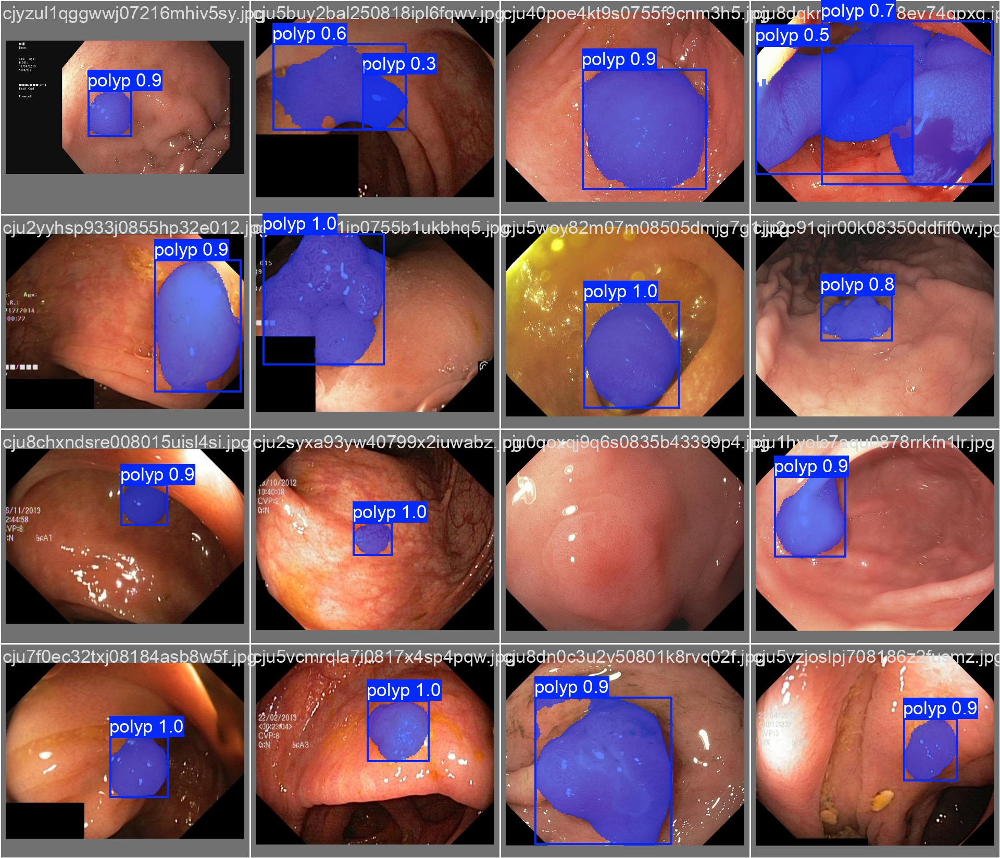
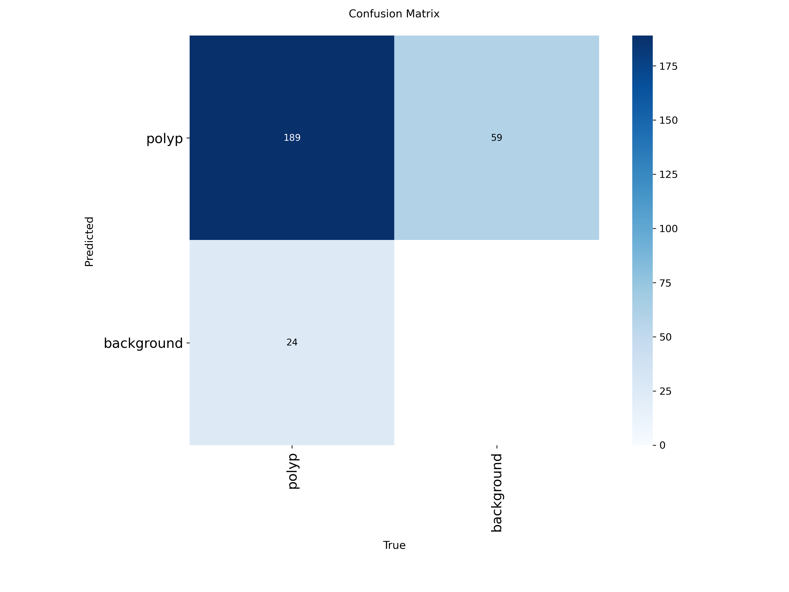
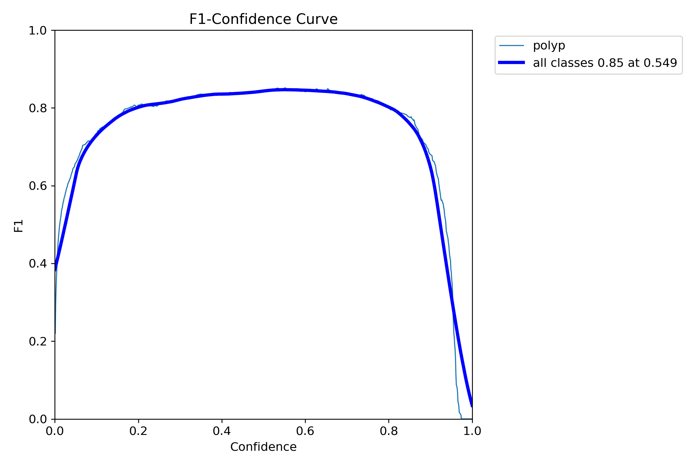

# 🔬🧬 PolySeg-YOLO: Segmentación de Instancias para la Prevención del Cáncer Colorrectal

---

## 🎯 Resumen del proyecto

Este proyecto desarrolla un sistema de visión artificial avanzado, denominado **PolySeg-YOLO**, enfocado en la detección temprana y delimitación geométrica estricta de pólipos colorrectales durante procedimientos de colonoscopía convencional. 

🔍 A diferencia de los sistemas de diagnóstico asistido por computadora (CADe) convencionales que suelen generar sobrediagnóstico al enfocarse en pólipos diminutos, esta solución implementa una arquitectura profunda de un solo paso (**YOLOv8-Instance Segmentation**) optimizada bajo un paradigma **local (*On-Premise*)**. Esto mitiga los riesgos de latencia y ciberseguridad clínica asociados con soluciones en la nube.

🧩 El modelo fue entrenado y validado utilizando el conjunto de datos médicos indexados **Kvasir-SEG**, alcanzando métricas de precisión sobresalientes y operando con una latencia ultrabaja apta para el soporte visual en tiempo real en la práctica clínica contemporánea.

📁 Este repositorio contiene los cuadernos interactivos de Python para la inferencia local de baja latencia, los scripts de análisis métrico cuantitativo y los pesos finales entrenados de la red.

---

## ✨ Características clave

- 🧠 **Segmentación de Instancias Robusta:** No solo detecta la presencia del pólipo mediante cajas, sino que extrae la máscara y morfología exacta a nivel de píxel para una discriminación geométrica estricta.
- ⏱️ **Procesamiento en Tiempo Real (Baja Latencia):** Registra una velocidad de inferencia promedio de **9.60 ms**, lo que elimina el desfase visual crítico para el endoscopista durante la navegación.
- 🔒 **Arquitectura Local (On-Premise):** Diseñado para operar sin conexión a internet externa dentro de la infraestructura hospitalaria, alineándose con estándares de protección de datos médicos.
- 📊 **Respaldo Científico Consolidado:** Incluye módulos analíticos dedicados a la visualización de matrices de confusión, curvas de confianza y métricas de validación global ($mAP_{50}$).

---

## 🛠️ Tecnologías utilizadas

| Componente         | Tecnología / Herramienta                                |
|--------------------|---------------------------------------------------------|
| 🚀 Core Deep Learning| Python + `ultralytics` (YOLOv8)                       |
| 👁️ Visión Artificial | OpenCV (`opencv-python`)                               |
| 📊 Análisis de Datos| Pandas + NumPy                                          |
| 📈 Visualización    | Matplotlib                                              |
| 🧬 Dataset Médico  | Kvasir-SEG (Segmented Polyp Dataset)                    |

---

---

## 📸 Galería del Proyecto y Análisis Visual
Visualizaciones clave del sistema y su rendimiento analítico.

   
  <em>Inferencia computarizada: Extracción simultánea de caja delimitadora y máscara de segmentación translúcida sobre la mucosa colónica.</em>

  
   
  <em>Izquierda: Matriz de confusión de la red. Derecha: Evaluación de la Curva F1-Score para determinar el umbral de confianza óptimo en la arquitectura local.</em>

---

---

## ⚖️ Licencia

Este proyecto está distribuido bajo la **Licencia MIT**. Esto significa que puedes usar, copiar, modificar y distribuir el código libremente, siempre y cuando se mantenga la atribución a los autores originales. Consulta el archivo `LICENSE` en la raíz de este repositorio para más detalles.

---

## 📄 Publicación Académica

Este repositorio de código complementa y respalda la investigación científica titulada **"Visión Profunda en Endoscopía: Segmentación de Alta precisión en Tiempo Real con PolySeg-YOLO"**. 

El artículo completo ha sido estructurado y remitido para su correspondiente revisión por pares y edición académica en la **Revista Ciencia y Reflexión**. Una copia preliminar del documento en formato manuscrito se encuentra disponible para su consulta dentro de este repositorio:

  <a href="#" target="_blank">
    
     <em>Preprint / Manuscrito del Artículo Científico (PDF)</em>
  </a>

  <a href="#" target="_blank">
    📎 <em>Acceso al portal oficial de la Revista Ciencia y Reflexión</em>
  </a>

